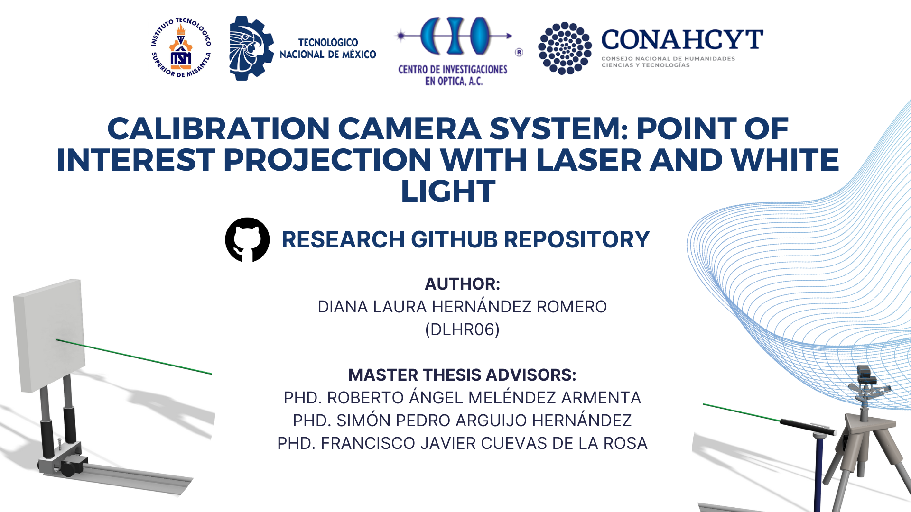

# Calibration Camera System: point of interest projection with laser and white light

This repository is about a calibration camera system project usin a point-of-interest projection by two devices: A laser pointer and white light project | Degree project of Computer Systems Master by TecNM Campus Misantla

## This repository is related to the final project for obtaining the degree of Master in Computer Systems at the Instituto Tecnológico Superior de Misantla.
## Allied research institutions
 * Consejo Nacional de Humanidades Ciencias y Tecnologías (CONAHCYT)
 * Centro de Investigaciones en Óptica A.C.  Campus León (CIO)

## Dataset of images

Con el siguiente link puedes visualizar la [página web] del portafolio (https://dlhr06.github.io/) 👩🏽‍💻💻🖇

## Lenguajes de programación

Este proyecto de investigación utilizo los siguientes lenguajes de programación:

* HTML
* CSS
* JavaScript 
* Bootstrap 5

