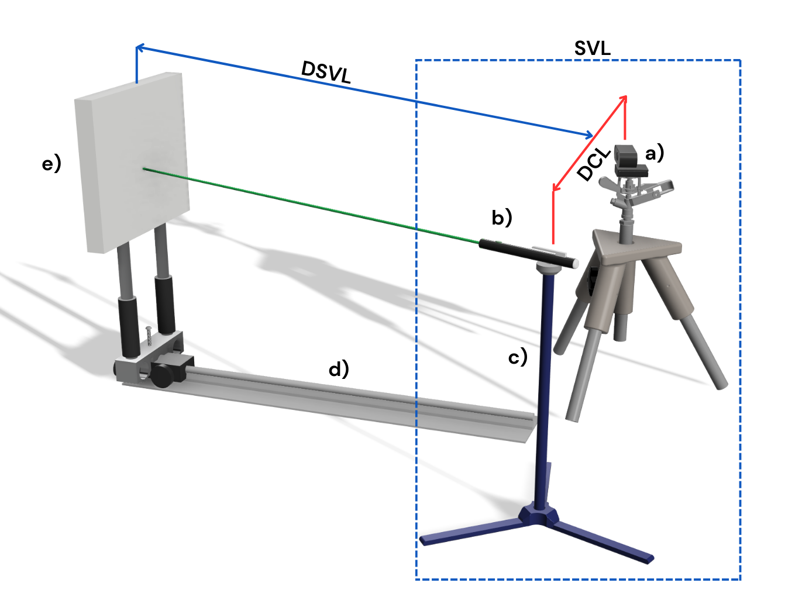
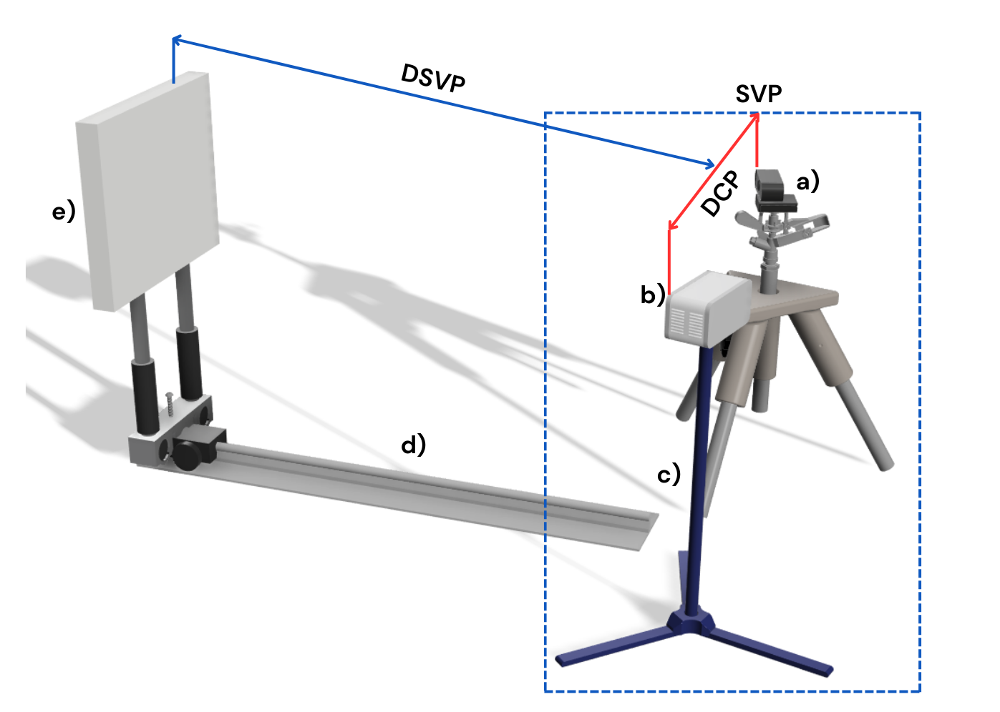

<h1 align="center" id="title">Design of calibration camera system 📷 </h1>

## Glossary abbreviations on images.  📚
1. To laser design
  * DSVL(Vision System Laser Distance)
  * SVL (Vision System Laser)
  * DCL (Camera to Laser Distance)
2. To white ligth projector design
  * DVSP (Vision System Projector Distance)
  * SVP  (Vision System Projector)
  * DCP  (Camera to Projector Distance)
3. To chessboard design 
  * DCC (Camera to Chessboard Distance)
  
## Design of calibration system using laser. 

In this Figure the elements of the calibration system can be visualized using laser as a projection method.  

## Design of calibration system using white light. 

In this Figure the elements of the calibration system can be visualized using white ligth as a projection method.  

## Design of calibration system using calibration pattern chessboard

In this Figure the elements of the calibration system can be visualized using a chessboard as a calibration pattern .  

