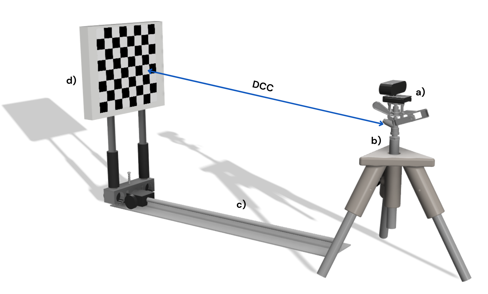

<h1 align="center" id="title">Design of calibration camera system 📷 </h1>

## Design of calibration system using laser. 

On image  the elements of the calibration system can be visualized using laser as a projection method.

## Design of calibration system using white light. 
